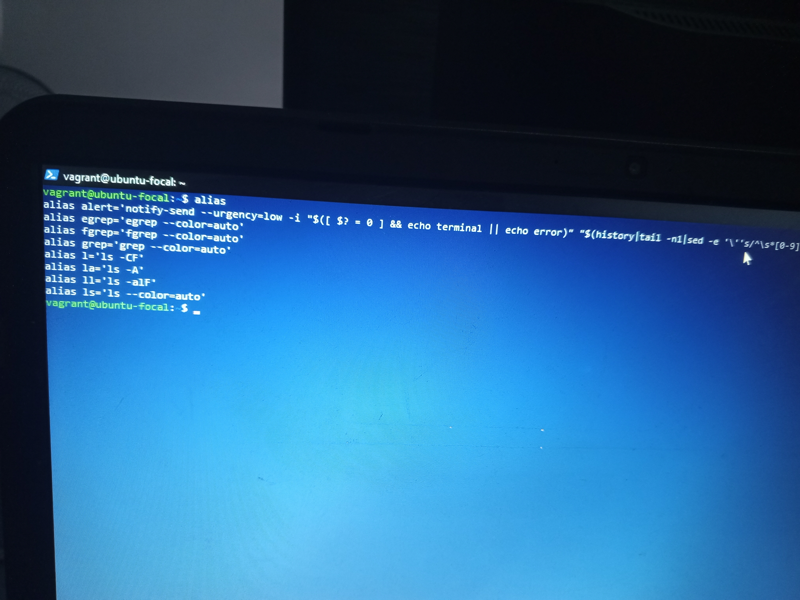

> Below are embeded details of this Exercise-2 commands output which we were instructed to attach:
# 1. Creates a Shortcut or Alias for a command or a set of commands.
 
# 2. Displays a Calendar.
 
# 3. Displays information about disk space usage on mounted files-Systems.

# 4. Shows the disk usage of files and directories. 

# 5. Searches for files and directories within a specified directory hierachy.

# 6. Lists previously executed commands in the current session or saved in the command history file.

# 7. Prints or sets the system's hostname.

# 8. Displays network connections, routing tables, interface statistics, masquerade connections, and multicast memberships. 

# 9. Provides information about processes currently running on the system. 

# 10. Securely copies files between hosts on a network using SSH protocol.

